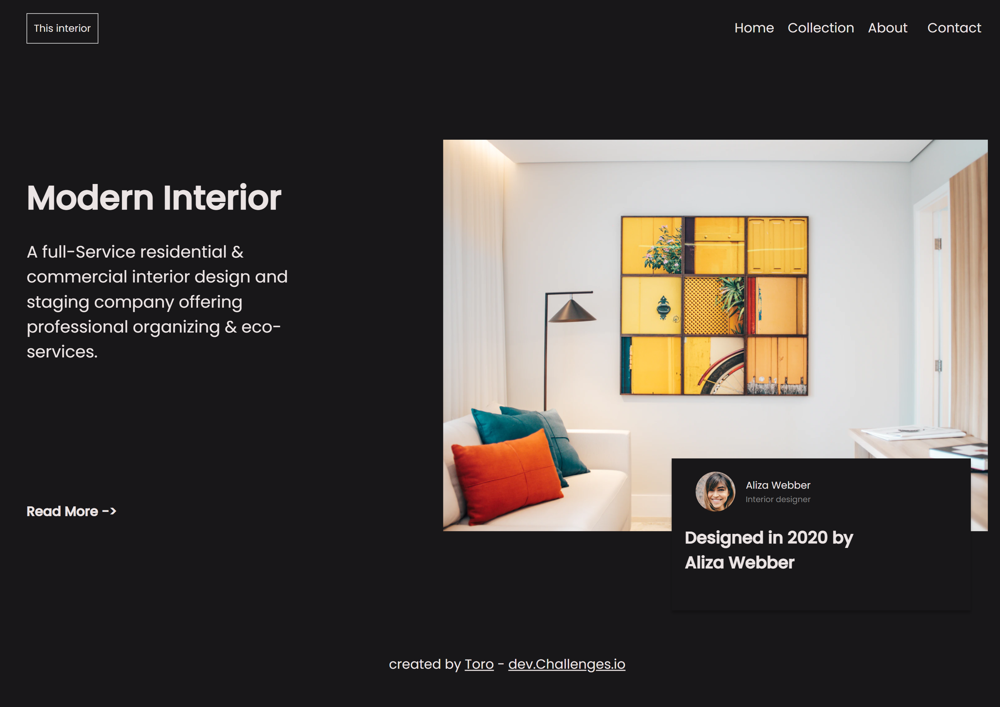

<!-- Please update value in the {}  -->

<h1 align="center">{Interior Consultant}</h1>

   Solution for a challenge from  <a href="http://devchallenges.io" target="_blank">Devchallenges.io</a>.

  <h3>
    <a href="https://xxtbmfxx.github.io/interior_consultant/">
      Demo
    </a>
     | 
    <a href="https://github.com/XxtbmfxX/interior_consultant">
      Solution
    </a>
     | 
    <a href="https://devchallenges.io/challenges/Jymh2b2FyebRTUljkNcb">
      Challenge
    </a>
  </h3>

<!-- TABLE OF CONTENTS -->

## Table of Contents

- [Overview](#overview)
- [Features](#features)
- [Acknowledgements](#acknowledgements)

<!-- OVERVIEW -->

## Overview

Introduce your projects by taking a screenshot or a gif. Try to tell visitors a story about your project by answering:

- Stop repeating flex display properties >\_<
- I don't know how to load the image :P

## Features

<!-- List the features of your application or follow the template. Don't share the figma file here :) -->

This application/site was created as a submission to a [DevChallenges](https://devchallenges.io/challenges) challenge. The [challenge](https://devchallenges.io/challenges/Jymh2b2FyebRTUljkNcb) was to build an application to complete the given user stories.

## Acknowledgements

Menu icon: Boostrap icons, [Iconst](https://icons.getbootstrap.com/icons/list/)
close icon: Ilham Fitrotuñ Hayat, [Flaticon](https://www.flaticon.com/free-icon/cross_3416079?term=close&page=1&position=17&origin=search&related_id=3416079)
